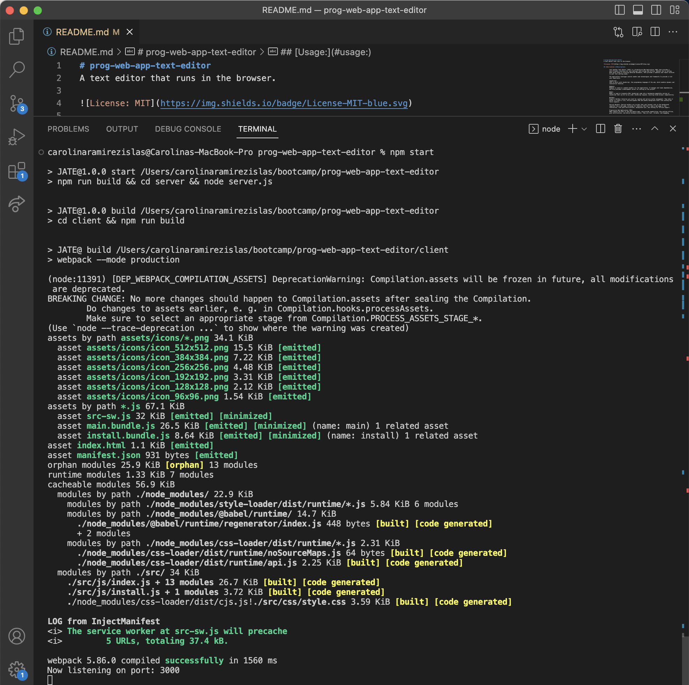

# prog-web-app-text-editor
A text editor that runs in the browser.

## [Description:](#description)

        Just Another Text Editor (JATE) is a Progressive Web Application (PWA) that provides a user-friendly interface for text editing, both online and offline. Whether you're jotting down quick notes or drafting detailed documents, JATE provides a seamless and robust solution to your text editing needs.

        The application leverages several modern web technologies and frameworks to provide a rich user experience:

        JavaScript: 
        JATE is built with JavaScript, the programming language of the web, which enables dynamic and interactive features.

        Webpack: 
        Webpack is used as a module bundler for the application. It manages and loads dependencies, and also provides a development server for working on the project.

        Babel: 
        Babel is used to transpile ES6+ JavaScript code into a backwards-compatible version of JavaScript that can be run by older JavaScript engines, ensuring broad browser compatibility.

        Workbox: 
        Google's Workbox libraries are used for caching and service worker management. They make it easier to create a rich, offline-capable PWA and handle background tasks like caching and fetch requests.

        Service Workers: Service workers are scripts that your browser runs in the background, separate from a web page, allowing for features that don't need a web page or user interaction, like push notifications, background sync, and caching for offline support.

        Progressive Web Application (PWA): 
        PWAs combine the best of web and mobile apps, and provide capabilities like working offline, push notifications, and device hardware access. They are fast, reliable, and engaging.

## [Table of Contents:](#table-of-contents:)
   
- [Description](#description)
- [Installation](#installation)
- [Usage](#usage)
- [License](#license)
- [Contributing](#contributing)
- [Tests](#tests)
- [Questions](#questions)
   
## [Installation:](#installation:)

    Before you continue, ensure you have met the following requirements:

    *You have installed Node.js which includes npm (Node Package Manager). If they're not, you can download and install Node.js (which includes npm) from the official website: https://nodejs.org/.

    Once those are installed:

    *Clone the repository or download the code to your local machine.
    *Navigate to the directory that contains the package.json file.
    *Install the nnecessary dependencies:

        To install the necessary dependencies, run the following command:
        
        npm install
    
        This command should be run in the directory that contains your package.json file, and it will install all the dependencies listed in that file.
    
## [Usage:](#usage:)

    To use the prog-web-app-text-editor you can directly go to the Heroku link without having to do anything else. 

Site on Heroku:

    Heroku Link:

    To access the Github Repository visit:
    https://github.com/CarolinaRaIs/prog-web-app-text-editor

    To access the deployed site visit:
    https://carolinarais.github.io/prog-web-app-text-editor/   

    
    WHEN I run `npm run start` from the root directory
    THEN I find that my application should start up the backend and serve the client
    WHEN I run the text editor application from my terminal
    THEN I find that my JavaScript files have been bundled using webpack
    WHEN I run my webpack plugins
    THEN I find that I have a generated HTML file, service worker, and a manifest file

## [License:](#license:)

       This project is licensed under the MIT license.
   
## [Contributing:](#contributing:)

       Contributions are welcome and encouraged for this project. If you find any issues or have any suggestions for new features, please open an issue or submit a pull request. Before submitting a pull request, please ensure that your code adheres to the project's coding guidelines and has appropriate test coverage. Thank you for your interest in contributing to this project!  

       Thank you [stellalph](https://github.com/stellalph) for sharing your knowledge to help in the completion of this project!
   
## [Tests:](#tests:)

       I encourage contributors to thoroughly explore the code and test it to ensure its functionality. Any feedback or suggestions regarding the testing process are welcomed and appreciated.
   
## [Questions:](#questions:)

       If you have any questions about the repo you can open an issue.

**If more questions arise you can also contact CarolinaRaIs at determination28@gmail.com**
   
       
------------------------------------------------------------------------------------------------
   
This README was generated by [CarolinaRaIs](https://github.com/CarolinaRaIs)